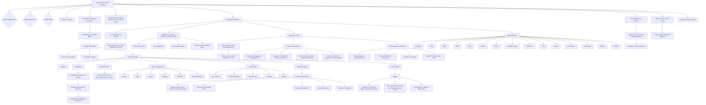

```mermaid
graph TD
    %% Main Topics
    A[Mechanically Intuitive Grappling] --> B1{FIRST FIGURE OUT}
    A --> B2{THEN FOCUS ON}
    A --> B3{FINISH WITH}
    
    %% Important Principles
    A --> C1[Stillness is Death]
    A --> C2[All Warfare is Based on Deception]
    A --> C3[Stretch Them Out, Wear Them Down, Skin Them in Layers]
    
    %% Pathfinding in a Problem Space
    C2 --> D1[Pathfinding in a Problem Space]
    D1 --> D2[Strategic Orientation]
    D2 --> D3[Control // Incapacitate]
    D2 --> D4[Separate // Escape]
    
    %% Tactical Concepts
    D2 --> E1[Tactical Concepts]
    E1 --> E2[Trapping]
    E1 --> E3[Disposition]
    E3 --> E4[Scrambled Elements of a Position]
    E4 --> E5[Build/Deny Mechanical Primitives]
    E5 --> E6[Seek/Deny Advantageous Connections]
    
    %% Linked Positions
    E1 --> F1[Linked Positions]
    F1 --> F2[Defined by Connection Both Sides Seek to Control]
    
    %% Axis of Engagement
    E1 --> G1[Axis of Engagement]
    G1 --> G2[Assault]
    G1 --> G3[Flank]
    G1 --> G4[Disrupt]
    G1 --> G5[Reinforce]
    G1 --> G6[Withdraw]
    G1 --> G7[Overcommitment]
    
    %% Tactical Details
    E1 --> H1[Tactic Details]
    H1 --> H2[Bait & Switch]
    H1 --> H3[Position Waterfall]
    H1 --> H4[Grip Reversal]
    H1 --> H5[Honeypot]
    H1 --> H6[Tanning]
    
    %% Defensive Depth
    E1 --> I1[Defensive Depth]
    I1 --> I2[Cumulative Advantage]
    I2 --> I3[Advance Along an Axis Only If Leads to Advantage]
    I2 --> I4[Primary and Secondary Axes]
    I2 --> I5[Ongoing Management]
    I2 --> I6[Targeted Removal]
    I2 --> I7[Positional Irrelevance]

    %% Energy Fight
    E1 --> J1[Energy Fight]
    J1 --> J2[Attrition]
    J2 --> J3[If Energy for One Side is Higher, Occupy the Position]
    J2 --> J4[Burst: Dynamically Commit and Trade Exposure for Power]
    J2 --> J5[Recomposition: Minimal Energy Axis]

    %% Mechanical Principles
    A --> K1[Mechanical Principles]
    K1 --> K2[You Can Only Move Yourself]
    K2 --> K3[Only as Much as You Have Stability & Structure]
    K1 --> K4[Bodies are Strongest When They Hinge & Twist]
    K4 --> K5[Move as One Unit]
    K4 --> K6[Move Balanced]
    K4 --> K7[Harness Momentum]
    K4 --> K8[Center Around an Athletic Base]
    
    %% Connection
    K1 --> L1[Connection is Key]
    L1 --> L2[Posts: Connect Joint to Ground/Opponent]
    L2 --> L3[Holds: Connect Part of Opponent to You]
    
    %% Types of Connections
    L1 --> M1[Types of Connections]
    M1 --> M2[Hooks: Hook Segment to Pull Opponent In]
    M1 --> M3[Locks: Lock Segment to Connect Back to You]
    M1 --> M4[Pins: Surround and Bury Segment Under You]
    M1 --> M5[Skewers: Stack Two Segments to Force Rotation]
    
    %% Advantageous Connections
    L1 --> N1[Advantageous Connections]
    N1 --> N2[Base Triangle vs Over/Under Pass]
    N1 --> N3[Posture Guillotine vs Double Leg]
    N1 --> N4[Leverage Low Single]
    N1 --> N5[Angle Arm Drag vs Arm Drag]
    
    %% Body and End Points
    K1 --> O1[Body End Points]
    O1 --> O2[Fingertips]
    O1 --> O3[Toes]
    O1 --> O4[Edges]
    O1 --> O5[Wrist]
    O1 --> O6[Ankle]
    O1 --> O7[Elbows]
    O1 --> O8[Knees]
    O1 --> O9[Shoulder Points]
    O1 --> O10[Hip Points]
    O1 --> O11[Core]
    O1 --> O12[Throat]
    O1 --> O13[Solar Plexus]
    O1 --> O14[Inside Hips]
    O1 --> O15[Armpits]
    O1 --> O16[Jawline]

    %% Breaking and Finishing Positions
    A --> P1[Breaking/Finishing Positions]
    P1 --> P2[Stable Structure Secured to Isolated Segment]
    P2 --> P3[Freedom to Hinge and Twist]

    %% Most Leverage and Control
    A --> Q1[Most Leverage // Most Control]
    Q1 --> Q2[Hinge & Twist Strength to Opponent]
    
    %% Final Concepts
    A --> R1[The Enemy Gate is Down]
```
